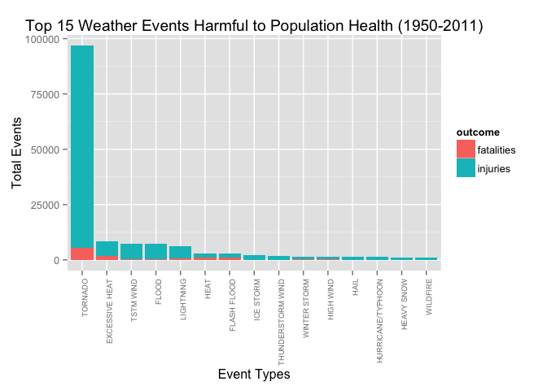
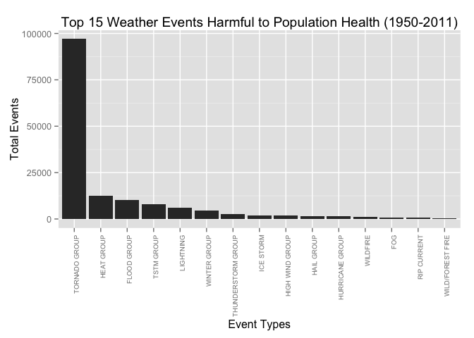
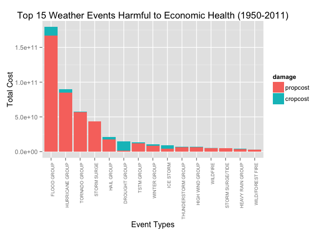

# Severe Weather Events Analysis (health and economic approaches) - 1950 to 2011
Daniel Rodrigues Ambrosio - based on NOAA Storm Database  
May 23, 2015  

## 1. Synopsis

Severe Weather events can cause damage to population health and also destruction of properties of all kinds. In order to identify which are the types of weather events that cause the most damage and also quantify those losses, the NOAA Storm Database (NSB) will be used. This database contains information about the severe weather events happening in the USA since 1950 up to 2011.

Analysing the data available in the NSB it is possible to identify that the type of event that causes the most fatalities and injuries in the population are by far the tornados.

On the other hand, the type of event that causes the most damage to properties and crops are the various types of floods, followed by the hurricanes and just then the tornados.

## 2. Overview

The goal of this analysis is to answer the following two questions using the NOAA Storm Database. Across the United States:

1. Which types of events are most harmful with respect to population health?

2. Which types of events have the greatest economic consequences?

The events in the database start in the year 1950 and end in November 2011. In the earlier years of the database there are generally fewer events recorded, most likely due to a lack of good records. More recent years should be considered more complete.

## 3. Data Processing

### 3.1 Environment

Being able to reproduce every step of a data analysis is a crucial aspect of the data science. That being said, all the libraries used as support for this analysis are listed below and so is the system information.


```r
library(ggplot2)
library(gdata)
library(dplyr)
library(reshape2)

# variables to handle path, dir and file names
dir.data <- paste(getwd(),"data",sep="/")
zipFile <- paste(dir.data,"StormData.csv.bz2",sep="/")

sessionInfo()
```

```
## R version 3.1.2 (2014-10-31)
## Platform: x86_64-apple-darwin13.4.0 (64-bit)
## 
## locale:
## [1] en_US.UTF-8/en_US.UTF-8/en_US.UTF-8/C/en_US.UTF-8/en_US.UTF-8
## 
## attached base packages:
## [1] stats     graphics  grDevices utils     datasets  methods   base     
## 
## other attached packages:
## [1] reshape2_1.4.1 dplyr_0.4.1    gdata_2.16.1   ggplot2_1.0.1 
## 
## loaded via a namespace (and not attached):
##  [1] assertthat_0.1   colorspace_1.2-6 DBI_0.3.1        digest_0.6.8    
##  [5] evaluate_0.7     formatR_1.2      grid_3.1.2       gtable_0.1.2    
##  [9] gtools_3.4.2     htmltools_0.2.6  knitr_1.10.5     magrittr_1.5    
## [13] MASS_7.3-35      munsell_0.4.2    parallel_3.1.2   plyr_1.8.1      
## [17] proto_0.3-10     Rcpp_0.11.4      rmarkdown_0.3.10 scales_0.2.4    
## [21] stringr_0.6.2    tools_3.1.2      yaml_2.1.13
```

### 3.2 Read and Process Data
The chunk of R Code below should download the storm data zip file from its original location (https://d396qusza40orc.cloudfront.net/repdata%2Fdata%2FStormData.csv.bz2) into a data folder.


```r
# if data folder does not exist, create it
if(!file.exists(dir.data)) {dir.create(dir.data)}

# donwload zip file only if it does not exist locally
if(!file.exists(zipFile)) {
    zipFileURL <- "https://d396qusza40orc.cloudfront.net/repdata%2Fdata%2FStormData.csv.bz2"
    download.file(zipFileURL, destfile=zipFile, method="curl", mode="wb")
}
```

After downloading it, read the raw data to be used in the project using the ``read.csv()`` method, that is able to read directly from the b-zipped file. After reading its content into memory, print the structure of the data using the ``str()`` function.


```r
# uncompress and read the CSV file
storm.data <- read.csv(zipFile)

# print the str for the data
str(storm.data)
```

```
## 'data.frame':	902297 obs. of  37 variables:
##  $ STATE__   : num  1 1 1 1 1 1 1 1 1 1 ...
##  $ BGN_DATE  : Factor w/ 16335 levels "1/1/1966 0:00:00",..: 6523 6523 4242 11116 2224 2224 2260 383 3980 3980 ...
##  $ BGN_TIME  : Factor w/ 3608 levels "00:00:00 AM",..: 272 287 2705 1683 2584 3186 242 1683 3186 3186 ...
##  $ TIME_ZONE : Factor w/ 22 levels "ADT","AKS","AST",..: 7 7 7 7 7 7 7 7 7 7 ...
##  $ COUNTY    : num  97 3 57 89 43 77 9 123 125 57 ...
##  $ COUNTYNAME: Factor w/ 29601 levels "","5NM E OF MACKINAC BRIDGE TO PRESQUE ISLE LT MI",..: 13513 1873 4598 10592 4372 10094 1973 23873 24418 4598 ...
##  $ STATE     : Factor w/ 72 levels "AK","AL","AM",..: 2 2 2 2 2 2 2 2 2 2 ...
##  $ EVTYPE    : Factor w/ 985 levels "   HIGH SURF ADVISORY",..: 834 834 834 834 834 834 834 834 834 834 ...
##  $ BGN_RANGE : num  0 0 0 0 0 0 0 0 0 0 ...
##  $ BGN_AZI   : Factor w/ 35 levels "","  N"," NW",..: 1 1 1 1 1 1 1 1 1 1 ...
##  $ BGN_LOCATI: Factor w/ 54429 levels ""," Christiansburg",..: 1 1 1 1 1 1 1 1 1 1 ...
##  $ END_DATE  : Factor w/ 6663 levels "","1/1/1993 0:00:00",..: 1 1 1 1 1 1 1 1 1 1 ...
##  $ END_TIME  : Factor w/ 3647 levels ""," 0900CST",..: 1 1 1 1 1 1 1 1 1 1 ...
##  $ COUNTY_END: num  0 0 0 0 0 0 0 0 0 0 ...
##  $ COUNTYENDN: logi  NA NA NA NA NA NA ...
##  $ END_RANGE : num  0 0 0 0 0 0 0 0 0 0 ...
##  $ END_AZI   : Factor w/ 24 levels "","E","ENE","ESE",..: 1 1 1 1 1 1 1 1 1 1 ...
##  $ END_LOCATI: Factor w/ 34506 levels ""," CANTON"," TULIA",..: 1 1 1 1 1 1 1 1 1 1 ...
##  $ LENGTH    : num  14 2 0.1 0 0 1.5 1.5 0 3.3 2.3 ...
##  $ WIDTH     : num  100 150 123 100 150 177 33 33 100 100 ...
##  $ F         : int  3 2 2 2 2 2 2 1 3 3 ...
##  $ MAG       : num  0 0 0 0 0 0 0 0 0 0 ...
##  $ FATALITIES: num  0 0 0 0 0 0 0 0 1 0 ...
##  $ INJURIES  : num  15 0 2 2 2 6 1 0 14 0 ...
##  $ PROPDMG   : num  25 2.5 25 2.5 2.5 2.5 2.5 2.5 25 25 ...
##  $ PROPDMGEXP: Factor w/ 19 levels "","-","?","+",..: 17 17 17 17 17 17 17 17 17 17 ...
##  $ CROPDMG   : num  0 0 0 0 0 0 0 0 0 0 ...
##  $ CROPDMGEXP: Factor w/ 9 levels "","?","0","2",..: 1 1 1 1 1 1 1 1 1 1 ...
##  $ WFO       : Factor w/ 542 levels ""," CI","%SD",..: 1 1 1 1 1 1 1 1 1 1 ...
##  $ STATEOFFIC: Factor w/ 250 levels "","ALABAMA, Central",..: 1 1 1 1 1 1 1 1 1 1 ...
##  $ ZONENAMES : Factor w/ 25112 levels "","                                                                                                                               "| __truncated__,..: 1 1 1 1 1 1 1 1 1 1 ...
##  $ LATITUDE  : num  3040 3042 3340 3458 3412 ...
##  $ LONGITUDE : num  8812 8755 8742 8626 8642 ...
##  $ LATITUDE_E: num  3051 0 0 0 0 ...
##  $ LONGITUDE_: num  8806 0 0 0 0 ...
##  $ REMARKS   : Factor w/ 436781 levels "","\t","\t\t",..: 1 1 1 1 1 1 1 1 1 1 ...
##  $ REFNUM    : num  1 2 3 4 5 6 7 8 9 10 ...
```

#### 3.2.1 Data Preparation for Harm to Health

The Storm Data has two columns that could be used to represent the harm done to the population health: *FATALITIES* and *INJURIES*. Simply adding these columns should suffice to represent one dimension of the study - *amount of harm*. The sum of these two columns is stored in a new column called *humanimpact*.


```r
storm.data$humanimpact <- storm.data$FATALITIES + storm.data$INJURIES
```

#### 3.2.2 Group Event Types

The other dimension is the type of storm event to be aggregated. After the ``str()`` function call above it was possible to notice that there are 985 types of events, which seems to be a lot of dimensions to be considered - this is the *EVTYPE* column. 

Looking further into the data it is possible to notice that there are some minor inconsistencies, like leading and trailing spaces, or upper case x lower case versions of the same event and some misspelled or very similar events. To try and group better the events some actions were taken:

- trim all event types (remove leading and trailing spaces)

- turn all event types into upper case

- group similar weather events into a new group that would reflect a consolidated view of types

These new categories are stored into a new column named ``eventtype``.


```r
storm.data$eventtype <- toupper(trim(storm.data$EVTYPE))
storm.data$eventtype[grep("BLIZZARD|FROST|FREEZE|FREEZING|SNOW|WINTER",storm.data$eventtype)]<-"WINTER GROUP"
storm.data$eventtype[grep("COASTAL",storm.data$eventtype)]<-"COASTAL GROUP"
storm.data$eventtype[grep("DROUGHT",storm.data$eventtype)]<-"DROUGHT GROUP"
storm.data$eventtype[grep("DRY",storm.data$eventtype)]<-"DROUGHT GROUP"
storm.data$eventtype[grep("FLOOD",storm.data$eventtype)]<-"FLOOD GROUP"
storm.data$eventtype[grep("HAIL",storm.data$eventtype)]<-"HAIL GROUP"
storm.data$eventtype[grep("HEAT",storm.data$eventtype)]<-"HEAT GROUP"
storm.data$eventtype[grep("HEAVY RAIN",storm.data$eventtype)]<-"HEAVY RAIN GROUP"
storm.data$eventtype[grep("HIGH WIND",storm.data$eventtype)]<-"HIGH WIND GROUP"
storm.data$eventtype[grep("HURRICANE",storm.data$eventtype)]<-"HURRICANE GROUP"
storm.data$eventtype[grep("THUNDERSTORM|THUNDEERSTORM|THUDERSTORM|THUNDERESTORM|THUNDERSTROM|THUNDERSTROM|THUNDERTORM|THUNDERTSORM|THUNDESTORM|THUNERSTORM",storm.data$eventtype)]<-"THUNDERSTORM GROUP"
storm.data$eventtype[grep("TORNADO",storm.data$eventtype)]<-"TORNADO GROUP"
storm.data$eventtype[grep("TROPICAL STORM|TSTM",storm.data$eventtype)]<-"TSTM GROUP"
storm.data$eventtype[grep("URBAN",storm.data$eventtype)]<-"URBAN GROUP"
```

**Note:** This has reduced the amount of event types to nearly 360, providing a more consistent grouping of events allowing us to aggregate on less groups.

#### 3.2.3 Convert Damage Costs Units

There are two fields that represent the economic damages done by severe weather conditions: *PROPDMG* and *CROPDMG*. The values in these columns however are not fully represented since there is another column for each of these ending in *EXP* (i.e *PROPDMGEXP* and *CROPDMGEXP*) which represents a multiplication factor depending on its value, according to the table below:

Type | Description | Numerical Value
-----|-------------|----------------
H, h | Hundred     | x 100
K, k | Thousand    | x 1000
M, m | Million     | x 1000000
B, b | Billion     | x 1000000000
other| Ignored     | x 1

A new column will then be created with the correct factor to be used for each value for the EXP Columns.


```r
# First trim and move all to upper case, to be sure we are dealing with all variables
storm.data$PROPDMGEXP <- toupper(trim(storm.data$PROPDMGEXP))
storm.data$CROPDMGEXP <- toupper(trim(storm.data$CROPDMGEXP))
# create prop factor
storm.data$propfactor<-1 # setting a default value of 1 for multiplication
storm.data$propfactor[storm.data$PROPDMGEXP=="H"]<-100        # one hundred
storm.data$propfactor[storm.data$PROPDMGEXP=="K"]<-1000       # one thousand
storm.data$propfactor[storm.data$PROPDMGEXP=="M"]<-1000000    # one million 
storm.data$propfactor[storm.data$PROPDMGEXP=="B"]<-1000000000 # one billion
# create crop factor
storm.data$cropfactor<-1 # setting a default of 1 for multiplication
storm.data$cropfactor[storm.data$CROPDMGEXP=="H"]<-100       # one hundred
storm.data$cropfactor[storm.data$CROPDMGEXP=="K"]<-1000       # one thousand
storm.data$cropfactor[storm.data$CROPDMGEXP=="M"]<-1000000    # one million
storm.data$cropfactor[storm.data$CROPDMGEXP=="B"]<-1000000000 # one billion

# use the new factors to calculate two new columns with the property and crop cost
storm.data$propcost <- storm.data$PROPDMG * storm.data$propfactor
storm.data$cropcost <- storm.data$CROPDMG * storm.data$cropfactor
```


## 4. Results

This section presents the process of analysis and data processing used to answer the two main questions of this project.

#### 4.1.1 Aggregate and plot the graph 

Considering fatalities and injuries as separate metrics to be analysed (i.e. without the grouping done in the previous section) we will notice that even though Tornados are leading both statistics, there is not a direct relation that the event that causes more injuries will also cause more fatalities. This is shown in the code below.


```r
healthimpact.fatalities <- storm.data %>%
                         select(EVTYPE, FATALITIES, INJURIES) %>% 
                         group_by(EVTYPE) %>%
                         summarise(fatalities=sum(FATALITIES), injuries=sum(INJURIES)) %>%
                         filter(fatalities + injuries > 0) %>%
                         arrange(desc(fatalities + injuries))
head(healthimpact.fatalities,10)
```

```
## Source: local data frame [10 x 3]
## 
##               EVTYPE fatalities injuries
## 1            TORNADO       5633    91346
## 2     EXCESSIVE HEAT       1903     6525
## 3          TSTM WIND        504     6957
## 4              FLOOD        470     6789
## 5          LIGHTNING        816     5230
## 6               HEAT        937     2100
## 7        FLASH FLOOD        978     1777
## 8          ICE STORM         89     1975
## 9  THUNDERSTORM WIND        133     1488
## 10      WINTER STORM        206     1321
```

```r
healthimpact.injuries <- healthimpact.fatalities %>% arrange(desc(injuries), desc(fatalities))
head(healthimpact.injuries,10)
```

```
## Source: local data frame [10 x 3]
## 
##               EVTYPE fatalities injuries
## 1            TORNADO       5633    91346
## 2          TSTM WIND        504     6957
## 3              FLOOD        470     6789
## 4     EXCESSIVE HEAT       1903     6525
## 5          LIGHTNING        816     5230
## 6               HEAT        937     2100
## 7          ICE STORM         89     1975
## 8        FLASH FLOOD        978     1777
## 9  THUNDERSTORM WIND        133     1488
## 10              HAIL         15     1361
```

On a different analysis we want to check which are the top 15 most dangerous weather events using the sum of the *FATALITIES* and *INJURIES*. On this analysis we are still using the original event types as provided by the raw data and not yet regrouped.


```r
healthimpact.m <- healthimpact.fatalities %>% arrange(desc(injuries+fatalities))
healthimpact.m <- melt(head(healthimpact.m,15),id.vars=c("EVTYPE"))
names(healthimpact.m) <- c("EVTYPE", "outcome", "count")

head(healthimpact.m,15)
```

```
##               EVTYPE    outcome count
## 1            TORNADO fatalities  5633
## 2     EXCESSIVE HEAT fatalities  1903
## 3          TSTM WIND fatalities   504
## 4              FLOOD fatalities   470
## 5          LIGHTNING fatalities   816
## 6               HEAT fatalities   937
## 7        FLASH FLOOD fatalities   978
## 8          ICE STORM fatalities    89
## 9  THUNDERSTORM WIND fatalities   133
## 10      WINTER STORM fatalities   206
## 11         HIGH WIND fatalities   248
## 12              HAIL fatalities    15
## 13 HURRICANE/TYPHOON fatalities    64
## 14        HEAVY SNOW fatalities   127
## 15          WILDFIRE fatalities    75
```

```r
g0 <- ggplot(healthimpact.m, aes(x = reorder(EVTYPE,-count), y = count,fill=outcome))
g0 <- g0 + geom_bar(stat='identity') +
    theme(axis.text.x = element_text(angle = 90, size = 7, hjust = 1 )) +
    ylab("Total Events") +
    xlab("Event Types")+
    ggtitle("Top 15 Weather Events Harmful to Population Health (1950-2011)")
print(g0)
```

 

Now aggregate the data into a new column on preparation to plot the graph that shows the human impact (injuries and fatalities) caused by each event type. Now we are using the new groups created in the Data Manipulation section.


```r
healthimpact.grouped <- aggregate(humanimpact ~ eventtype, data=storm.data, sum, na.rm = TRUE)
healthimpact.grouped <- healthimpact.grouped[with(healthimpact.grouped, order(-humanimpact, eventtype)),]

head(healthimpact.grouped, 15)
```

```
##              eventtype humanimpact
## 300      TORNADO GROUP       97043
## 90          HEAT GROUP       12341
## 66         FLOOD GROUP       10116
## 305         TSTM GROUP        7933
## 139          LIGHTNING        6046
## 362       WINTER GROUP        4463
## 299 THUNDERSTORM GROUP        2689
## 130          ICE STORM        2064
## 114    HIGH WIND GROUP        1758
## 88          HAIL GROUP        1512
## 118    HURRICANE GROUP        1461
## 352           WILDFIRE         986
## 67                 FOG         796
## 205        RIP CURRENT         600
## 350   WILD/FOREST FIRE         557
```

Order the data and plot the graph that will show the top 15 most harmful weather event types when it comes to kill or endanger the lives of people.


```r
g1 <- ggplot(head(healthimpact.grouped,15), aes(reorder(eventtype,-humanimpact), humanimpact))
g1 <- g1 + geom_bar(stat = "identity") +
    theme(axis.text.x = element_text(angle = 90, size = 7, hjust = 1 ), legend.position="none") +
    ylab("Total Events") +
    xlab("Event Types")+
    ggtitle("Top 15 Weather Events Harmful to Population Health (1950-2011)")
print(g1)
```

 

### 4.2 Which types of events have the greatest economic consequences?

The logic used to calculate the economic impact is the same used in the previous sections. We will calculate the cost of damage to properties and crops per group of event types (not the original ones) and then plot a graph where the top 15 with most damage are shown in order.


```r
costimpact.df <- storm.data %>%
                 select(eventtype, propcost, cropcost) %>% 
                 group_by(eventtype) %>%
                 summarise(propcost=sum(propcost), cropcost=sum(cropcost)) %>%
                 filter(propcost + cropcost > 0) %>%
                 arrange(desc(propcost + cropcost))
head(costimpact.df,10)
```

```
## Source: local data frame [10 x 3]
## 
##             eventtype     propcost    cropcost
## 1         FLOOD GROUP 167090574872 12380033100
## 2     HURRICANE GROUP  84656180010  5505292800
## 3       TORNADO GROUP  56993098029   414961520
## 4         STORM SURGE  43323536000        5000
## 5          HAIL GROUP  17619991567  3114212873
## 6       DROUGHT GROUP   1053038600 13972636780
## 7          TSTM GROUP  12213583545  1248903350
## 8        WINTER GROUP   8499183453  2291248100
## 9           ICE STORM   3944927860  5022113500
## 10 THUNDERSTORM GROUP   6431645637   652851388
```

```r
costimpact.m <- melt(head(costimpact.df,15),id.vars=c("eventtype"))
names(costimpact.m) <- c("eventtype", "damage", "cost")

g2 <- ggplot(costimpact.m, aes(x = reorder(eventtype,-cost), y = cost,fill=damage))
g2 <- g2 + geom_bar(stat='identity') +
    theme(axis.text.x = element_text(angle = 90, size = 7, hjust = 1 )) +
    ylab("Total Cost") +
    xlab("Event Types")+
    ggtitle("Top 15 Weather Events Harmful to Economic Health (1950-2011)")
print(g2)
```

 

## 5. Appendix

1. You can find the original R markdown file used to build this document on Daniel Ambrosio's github repository: [Coursera RepData_PeerAssessment2](https://github.com/daniambrosio/RepData_PeerAssessment2)

2. I found help on the work of others in RPubs, specially from this [other nice NOAA study](https://rpubs.com/seversond/81819).
